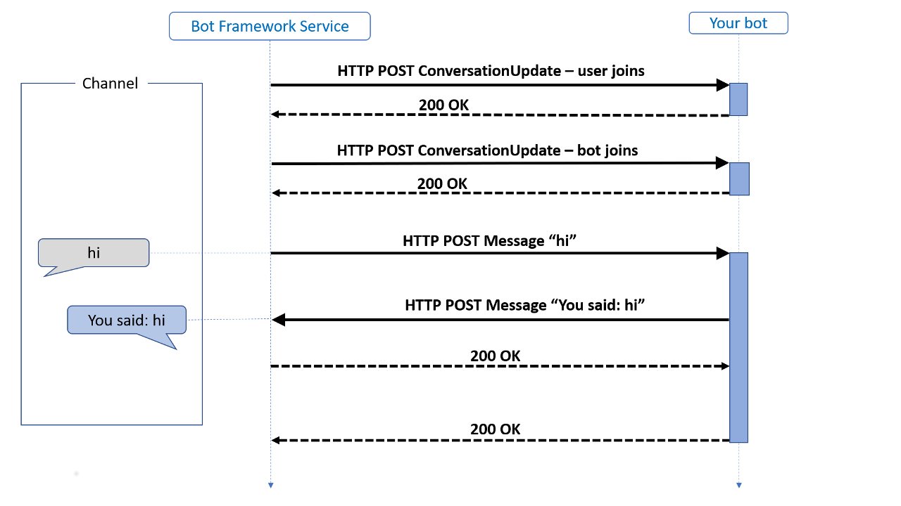
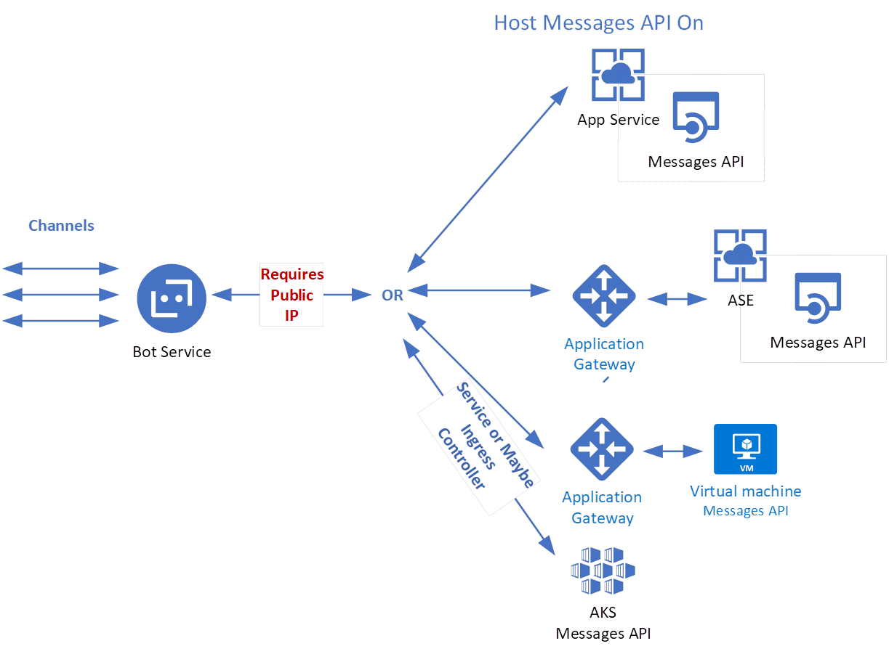

# A Developer's Guide to develop Chat Bots with Bot Framework v.4 and .Net Core

# Introduction

The purpose of this guide to is help .Net developers to understand the development concepts related to the Chat Bot Framework v4 and .Net Core 2.1.

## Skills

- .Net Development
- Calling APIs particularly congnitive services (QnA Maker, LUIS, etc.) and others exposed internally (hybrid scenario or cloud) and externally (i.e. api.creditcard.com)

## Developer Concepts

- Dependency Injection
  - https://docs.microsoft.com/en-us/aspnet/core/fundamentals/dependency-injection?view=aspnetcore-2.1
- Middleware
  - https://docs.microsoft.com/en-us/aspnet/core/fundamentals/middleware/?view=aspnetcore-2.1
  - https://docs.microsoft.com/en-us/aspnet/core/fundamentals/middleware/write?view=aspnetcore-2.1
- Async/Await
  - https://docs.microsoft.com/en-us/dotnet/csharp/programming-guide/concepts/async/
- Other .Net Core Fundamentals
  - https://docs.microsoft.com/en-us/aspnet/core/fundamentals/?view=aspnetcore-2.1&tabs=macos

## Bot Concepts

- **Bot Service/Channels:** a component of the Azure Bot Service, sends information between the user's bot-connected app (such as Facebook, Skype, Slack, etc. which we call the channel) and the bot. Each channel may include additional information in the activities they send.
- **Activity:** an interaction between the user and the bot. Activities arrive at the bot from the Bot Framework Service via an HTTP POST request. The bot responds to the inbound POST request with a 200 HTTP status code. Activities sent from the bot to the channel are sent on a separate HTTP POST to the Bot Framework Service. This, in turn, is acknowledged with a 200 HTTP status code.
- **Turn:** a turn consists of the user's incoming activity to the bot and any activity the bot sends back to the user as an immediate response. You can think of a turn as the processing associated with the arrival of a given activity. The turn context object provides information about the activity such as the sender and receiver, the channel, and other data needed to process the activity. It also allows for the addition of information during the turn across various layers of the bot. 
- **Turn context:** is one of the most important abstractions in the SDK. Not only does it carry the inbound activity to all the middleware components and the application logic but it also provides the mechanism whereby the middleware components and the application logic can send outbound activities.
- **Adapter:** The adapter, an integrated component of the SDK, is the core of the SDK runtime. The activity is carried as JSON in the HTTP POST body. This JSON is deserialized to create the Activity object that is then handed to the adapter with a call to process activity method. On receiving the activity, the adapter creates a turn context and calls the middleware.

- More on how bots work:
  - https://docs.microsoft.com/en-us/azure/bot-service/bot-builder-basics?view=azure-bot-service-4.0&tabs=csharp
- **State Management:** a bot is inherently stateless; a different instance of your bot may handle any given turn of the conversation. Maintaining state allows your bot to have more meaningful conversations by remembering certain things about a user or conversation.
  - The Bot Framework SDK includes some implementations for the storage layer:
    - Memory storage implements in-memory storage for testing purposes. In-memory data storage is intended for local testing only as this storage is volatile and temporary. The data is cleared each time the bot is restarted.
    - Azure Blob Storage connects to an Azure Blob Storage object database.
    - Azure Cosmos DB storage connects to a Cosmos DB NoSQL database.
  - State properties are lumped into scoped "buckets", which are just collections to help organize those properties. The SDK includes three of these "buckets"
    - User state: is available in any turn that the bot is conversing with that user on that channel, regardless of the conversation
    - Conversation: state is available in any turn in a specific conversation, regardless of user (i.e. group conversations)
    - Private conversation: state is scoped to both the specific conversation and to that specific user
  - When to use each type of state:
    - Conversation state is good for tracking the context of the conversation, such as:
      - Whether the bot asked the user a question, and which question that was
      - What the current topic of conversation is, or what the last one was
    - User state is good for tracking information about the user, such as:
      - Non-critical user information, such as name and preferences, an alarm setting, or an alert preference
      - Information about the last conversation they had with the bot
    - Private conversation state is good for channels that support group conversations, but where you want to track both user and conversation specific information. For example, if you had a classroom clicker bot:
      - The bot could aggregate and display student responses for a given question.
      - The bot could aggregate each student's performance and privately relay that back to them at the end of the session.
  - More on state:
    - https://docs.microsoft.com/en-us/azure/bot-service/bot-builder-concept-state?view=azure-bot-service-4.0
    - https://docs.microsoft.com/en-us/azure/bot-service/bot-builder-howto-v4-state?view=azure-bot-service-4.0&tabs=csharp

## Dialogs

Dialogs are a central concept in the SDK, and provide a useful way to manage a conversation with the user. Dialogs are structures in your bot that act like functions in your bot's program; each dialog is designed to perform a specific task, in a specific order. You can specify the order of individual dialogs to guide the conversation, and invoke them in different ways - sometimes in response to a user, sometimes in response to some outside stimuli, or from other dialogs.

### Dialog State

Dialogs are an approach to implementing a multi-turn conversation, and as such, they are an example of a feature in the SDK that relies on persisted state across multiple turns. Without state in dialogs, your bot wouldn't know where in the dialog set it is or what information it has already gathered.

### Dialog types

Dialogs come in a few different types: prompts, waterfall dialogs, and component dialogs, as shown in this class hierarchy.

## Bot Deployment

## Bot Samples and Tools

- Bot Framework Emulator
  - https://github.com/Microsoft/BotFramework-Emulator/releases/tag/v4.5.2
- Ngrok
  - https://ngrok.com/
- Bot Framework Samples
  - https://github.com/Microsoft/BotBuilder-Samples/blob/master/README.md
- SDK Source Code
  - https://github.com/Microsoft/botbuilder-dotnet/#packages
  
## Other links

- Managing State
  - https://docs.microsoft.com/en-us/azure/bot-service/bot-builder-concept-state?view=azure-bot-service-4.0
- Dialogs 
  - https://docs.microsoft.com/en-us/azure/bot-service/bot-builder-concept-dialog?view=azure-bot-service-4.0
- Middleware
  - https://docs.microsoft.com/en-us/azure/bot-service/bot-builder-concept-middleware?view=azure-bot-service-4.0

